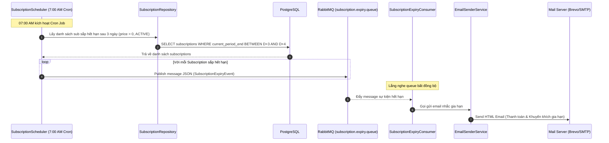

 # 📃 TÀI LIỆU THIẾT KẾ: TỰ ĐỘNG GỬI EMAIL NHẮC GIA HẠN GÓI DỊCH VỤ SẮP HẾT HẠN

* **Ngày tạo:** 2026-05-23
* **Người thực hiện:** Antigravity (AI Assistant)
* **Trạng thái:** ĐÃ PHÊ DUYỆT THIẾT KẾ
* **Nhánh phát triển:** `feat/subscription-expiry-notification`

---

## 🏛️ 1. Mục tiêu & Phạm vi (Goal & Scope)

### Mục tiêu chính:
Xây dựng một hệ thống quét lịch biểu (Scheduler) tự động chạy hàng ngày vào lúc **7h00 sáng (múi giờ Việt Nam)** để tìm kiếm các gói đăng ký dịch vụ (Subscription) trả phí sắp hết hạn sau đúng **3 ngày**. Sau đó, gửi một email HTML nhắc nhở cao cấp khuyến khích khách hàng gia hạn dịch vụ để tránh gián đoạn giám sát API.

### Phạm vi nghiệp vụ:
1. **Lọc thông minh đối tượng gửi:**
   * Chỉ quét các Subscription ở trạng thái `ACTIVE`.
   * **Loại trừ gói FREE:** Chỉ gửi email cho các gói dịch vụ có giá `plan.price > 0` (các gói trả phí như Pro, Premium, Enterprise).
2. **Kiến trúc Hướng sự kiện (Event-Driven):** Sử dụng **RabbitMQ** (`subscription.expiry.queue`) để làm hàng đợi đệm bất đồng bộ. Tách biệt trách nhiệm giữa bộ phận quét lịch biểu (Scheduler) và bộ phận xử lý gửi thư (Consumer), tăng độ bền vững và khả năng chịu tải của hệ thống.
3. **Mẫu Email HTML Cao cấp:** Email gửi tới người dùng được định dạng HTML chuyên nghiệp, hiển thị chi tiết tên gói dịch vụ, ngày hết hạn và nút bấm Call-To-Action (CTA) dẫn trực tiếp đến trang gia hạn/thanh toán.

---

## 🏗️ 2. Kiến trúc & Luồng dữ liệu (Architecture & Data Flow)

Hệ thống hoạt động theo mô hình không đồng bộ hướng sự kiện:



---

## 🗄️ 3. Thiết kế Tầng dữ liệu & Tối ưu hóa truy vấn

Để tránh lỗi hiệu năng kinh điển **N+1 Query** của Hibernate/JPA khi duyệt danh sách các subscription và gọi lấy email người dùng hay tên gói, truy vấn JPA được cấu hình nạp sẵn thông tin liên kết (`JOIN FETCH`):

```java
@Query("SELECT s FROM Subscription s " +
       "JOIN FETCH s.user " +
       "JOIN FETCH s.plan " +
       "WHERE s.status = :status " +
       "AND s.currentPeriodEnd >= :startDate " +
       "AND s.currentPeriodEnd <= :endDate " +
       "AND s.plan.price > 0")
List<Subscription> findActivePaidSubscriptionsExpiringBetween(
        @Param("status") SubscriptionStatus status,
        @Param("startDate") LocalDateTime startDate,
        @Param("endDate") LocalDateTime endDate);
```

---

## ⚙️ 4. Thiết kế Kỹ thuật chi tiết (Technical Specification)

### 4.1 Cấu hình RabbitMQ (`SubscriptionExpiryMQConfig.java`)
*   **Tên Queue:** `subscription.expiry.queue`
*   **Tính chất:** `durable = true` (Không mất mát dữ liệu khi RabbitMQ bị tắt đột ngột).

### 4.2 Định dạng Sự kiện hết hạn (`SubscriptionExpiryEvent.java`)
Đóng gói thông tin bằng đối tượng Java Record:
*   `subscriptionId` (String): ID của đăng ký dịch vụ.
*   `userEmail` (String): Email của người nhận.
*   `userName` (String): Tên hiển thị của khách hàng.
*   `planName` (String): Tên gói dịch vụ đang sử dụng.
*   `expiryDate` (String): Ngày hết hạn (định dạng sẵn dạng `"dd/MM/yyyy"`).

### 4.3 Scheduler quét định kỳ (`SubscriptionExpiryScheduler.java`)
*   Sử dụng Cron Job: `@Scheduled(cron = "0 0 7 * * ?", zone = "Asia/Ho_Chi_Minh")`.
*   Xác định chính xác khoảng thời gian của 3 ngày tiếp theo:
    *   `startDate` = `LocalDateTime.now().plusDays(3).with(LocalTime.MIN)` (00:00:00).
    *   `endDate` = `LocalDateTime.now().plusDays(3).with(LocalTime.MAX)` (23:59:59).

### 4.4 Consumer gửi email (`SubscriptionExpiryConsumer.java`)
*   Lắng nghe queue `subscription.expiry.queue`.
*   Gặp lỗi SMTP sẽ ném lỗi để kích hoạt cơ chế retry của RabbitMQ, đảm bảo không bị mất email nhắc nhở.

### 4.5 Giao diện Email HTML Nhắc nhở
*   Thiết kế cao cấp với tông màu chủ đạo Indigo (#4f46e5) và Blue (#3b82f6) gradient.
*   Hộp cảnh báo (Warning Alert Box) nêu rõ tác hại của việc bị hạ cấp về gói Free (mất monitor, tăng interval).
*   Nút bấm CTA chuyển hướng trực tiếp đến trang Billing của hệ thống FE (`http://localhost:3000/admin/billing`).

---

## 🧪 5. Kế hoạch Kiểm thử & Xác minh (Verification Plan)
1. **Kiểm thử logic truy vấn:** Viết JUnit test hoặc chạy thử nghiệm để kiểm tra câu lệnh `JOIN FETCH` lọc chính xác các gói trả phí sắp hết hạn và loại trừ thành công các gói FREE.
2. **Kiểm thử tích hợp (End-to-End):**
   * Đổi tạm thời thời gian chạy Cron thành `@Scheduled(fixedRate = 60000)` (chạy mỗi phút).
   * Thêm một bản ghi subscription trả phí trong DB có `currentPeriodEnd` là 3 ngày sau.
   * Xác nhận Scheduler phát hiện chính xác, đẩy message thành công lên RabbitMQ.
   * Xác nhận Consumer nhận tin nhắn, giải mã JSON và gửi email HTML thành công tới hòm thư kiểm thử thông qua JavaMailSender.
