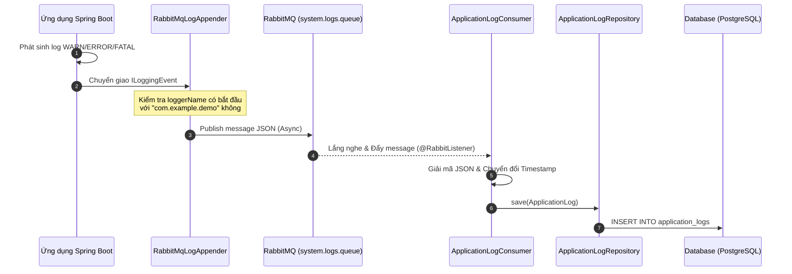

# 📃 TÀI LIỆU THIẾT KẾ: GIÁM SÁT LOG LỖI HỆ THỐNG (APPLICATION LOGS)

* **Ngày tạo:** 2026-05-23
* **Người thực hiện:** Antigravity (AI Assistant)
* **Trạng thái:** ĐÃ PHÊ DUYỆT THIẾT KẾ
* **Nhánh phát triển:** `feat/system-logs`

---

## 🏛️ 1. Mục tiêu & Phạm vi (Goal & Scope)

### Mục tiêu chính:
Xây dựng phân hệ thu thập, quản lý và giám sát **Log lỗi của chính ứng dụng Backend (Application/System Logs)** để hiển thị động lên giao diện quản trị Admin (`AdminSystemLogs.jsx`), thay thế cho toàn bộ dữ liệu mock hiện tại.

### Phạm vi nghiệp vụ:
1. **Lọc và phân loại log tối ưu:** Chỉ lưu trữ các log cấp độ `WARN`, `ERROR` và `FATAL` thuộc package nội bộ `com.example.demo` để tránh lãng phí dung lượng DB và nghẽn I/O bởi các log bên thứ ba (Spring, Hibernate, v.v.). Các log `INFO` thông thường chỉ xuất ra Console/File.
2. **Xử lý bất đồng bộ:** Sử dụng **RabbitMQ** làm hàng đợi đệm để thu thập log không đồng bộ (Asynchronous), giúp luồng xử lý chính của người dùng không bị block khi ghi log lỗi.
3. **Thống kê trong ngày:** Thống kê tổng số logs và số lượng log theo từng cấp độ phát sinh từ `00:00:00` hôm nay.
4. **Dọn dẹp tự động & thủ công:** Hỗ trợ API dọn dẹp log thủ công và tích hợp Cron Job tự động xóa các log cũ hơn 30 ngày vào lúc `02:00 AM` hàng ngày.
5. **Bảo mật tuyệt đối:** Tất cả các Endpoint API giám sát log hệ thống chỉ cho phép tài khoản có vai trò `ADMIN` truy cập.

---

## 🏗️ 2. Kiến trúc & Luồng dữ liệu (Architecture & Data Flow)

Hệ thống hoạt động theo mô hình hướng sự kiện không đồng bộ:



---

## 🗄️ 3. Thiết kế Cơ sở dữ liệu (Database Schema)

Bảng **`application_logs`** được thiết kế tối ưu với chỉ mục (Index) trên các cột thường xuyên được truy vấn bộ lọc và sắp xếp thời gian.

```sql
CREATE TABLE application_logs (
    id UUID PRIMARY KEY,
    timestamp TIMESTAMP NOT NULL,
    level VARCHAR(10) NOT NULL,
    component VARCHAR(255) NOT NULL,
    thread_id VARCHAR(100),
    message TEXT NOT NULL,
    stack_trace TEXT
);

-- Đánh chỉ mục để tối ưu hóa truy vấn tìm kiếm
CREATE INDEX idx_app_log_timestamp ON application_logs(timestamp DESC);
CREATE INDEX idx_app_log_level ON application_logs(level);
CREATE INDEX idx_app_log_component ON application_logs(component);
```

---

## ⚙️ 4. Thiết kế Kỹ thuật chi tiết (Technical Specification)

### 4.1 Custom Logback Appender (`RabbitMqLogAppender.java`)
* Sử dụng thư viện **RabbitMQ Java Client thuần** (`com.rabbitmq.client`) để kết nối. Điều này giúp cô lập Logback độc lập hoàn toàn khỏi Spring Application Context lúc khởi động, loại bỏ 100% lỗi Circular Dependency.
* Tự động format StackTrace thành dạng chuỗi văn bản nếu sự kiện log đi kèm Exception.
* Cấu hình trong `logback-spring.xml` lọc cấp độ log chỉ nhận từ cấp độ `WARN` trở lên của package `com.example.demo`.

### 4.2 RabbitMQ Consumer (`ApplicationLogConsumer.java`)
* Lắng nghe queue `system.logs.queue`.
* Chuyển đổi timestamp dạng epoch millisecond sang `LocalDateTime` dựa trên Timezone của hệ thống.
* Lưu bản ghi log lỗi vào database.

### 4.3 Service Layer (`ApplicationLogServiceImpl.java`)
* **`getLogs(...)`**: Sử dụng `Specification` trong Spring Data JPA để tạo câu lệnh tìm kiếm động phức tạp:
  * Lọc theo Level (`WARN`, `ERROR`, `FATAL` hoặc `ALL`).
  * Lọc tìm kiếm từ khóa không phân biệt hoa/thường (`like %keyword%`) đồng thời trên 3 cột: `message`, `component`, và `threadId`.
  * Lọc nhanh theo khoảng thời gian (`5m`, `1h`, `24h` hoặc `ALL`).
  * Trả về kết quả phân trang và sắp xếp giảm dần theo thời gian log (`timestamp DESC`).
* **`getTodayStats()`**: Tính toán số lượng log phát sinh hôm nay tính từ `00:00:00`.
* **`clearOldLogs(retentionDays)`**: Thực hiện xóa các log có `timestamp < now() - retentionDays` bằng câu lệnh Bulk Delete tối ưu.
* **`autoClearOldLogs()`**: Cron Job định kỳ chạy bằng `@Scheduled(cron = "0 0 2 * * ?")` lúc 2 giờ sáng hàng ngày, tự động dọn dẹp các log cũ hơn 30 ngày.

### 4.4 Controller Layer (`ApplicationLogController.java`)
* Lộ trình Endpoint: `/api/v1/admin/system-logs`.
* Bảo mật mức Controller sử dụng `@PreAuthorize("hasRole('ADMIN')")`.

---

## 🔒 5. Các Endpoint API Chi tiết

### 📑 API 1: Lấy danh sách System Logs (Phân trang & Bộ lọc)
* **Method:** `GET`
* **Path:** `/api/v1/admin/system-logs`
* **Tham số đầu vào (Query Params):**
  * `page` (Integer, default `0`): Trang cần lấy.
  * `size` (Integer, default `50`): Số lượng dòng log trên mỗi trang.
  * `level` (String, default `ALL`): Cấp độ lọc (`ALL`, `WARN`, `ERROR`, `FATAL`).
  * `keyword` (String, optional): Từ khóa tìm kiếm toàn văn.
  * `timeRange` (String, default `ALL`): Lọc thời gian (`ALL`, `5m`, `1h`, `24h`).
* **Dữ liệu đầu ra (JSON):** Định dạng chuẩn `org.springframework.data.domain.Page`.

### 📊 API 2: Số liệu thống kê logs trong ngày hôm nay
* **Method:** `GET`
* **Path:** `/api/v1/admin/system-logs/stats`
* **Dữ liệu đầu ra (JSON):**
  ```json
  {
    "total": 45,
    "infos": 0,
    "warnings": 32,
    "errors": 12,
    "fatals": 1
  }
  ```

### 🧹 API 3: Dọn dẹp log thủ công
* **Method:** `DELETE`
* **Path:** `/api/v1/admin/system-logs/clear`
* **Tham số đầu vào (Query Params):**
  * `retentionDays` (Integer, default `30`): Số ngày giữ lại logs.
* **Dữ liệu đầu ra (JSON):**
  ```json
  {
    "success": true,
    "message": "Successfully cleared 150 old log records older than 30 days.",
    "deletedCount": 150,
    "retentionDays": 30
  }
  ```

---

## 🧪 6. Kế hoạch Kiểm thử & Xác minh (Verification Plan)
1. **Biên dịch dự án:** Chạy lệnh `.\mvnw.cmd compile` để đảm bảo không lỗi cú pháp.
2. **Kiểm thử tích hợp (Integration Verification):**
   * Khởi chạy ứng dụng và cố ý tạo ra một số log lỗi (ví dụ: gọi một API lỗi hoặc cấu hình sai kết nối).
   * Kiểm tra hàng đợi `system.logs.queue` trên RabbitMQ Management Console xem message log có được đẩy lên không.
   * Kiểm tra database bảng `application_logs` xem log đã được ghi nhận đúng cấu trúc chưa.
   * Gọi API GET `/api/v1/admin/system-logs` để xác minh phân trang, lọc và tìm kiếm từ khóa hoạt động hoàn hảo.
