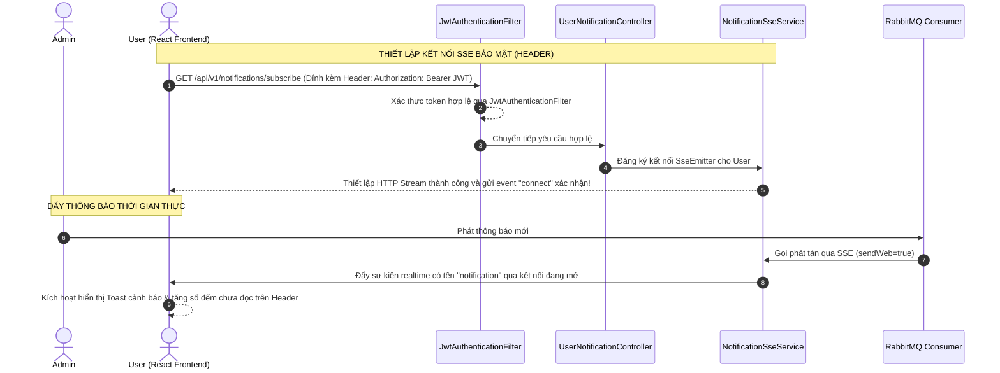

# Đặc tả thiết kế: Đẩy thông báo thời gian thực qua Server-Sent Events (SSE) và Polyfill Bảo mật

> **Trạng thái:** Chờ phê duyệt từ User (Phương án: Gửi Token qua Header sử dụng Polyfill ở Frontend)
> **Mục tiêu:** Thiết kế kênh truyền tải thông báo thời gian thực (Push Notifications) bảo mật từ Backend Spring Boot đến Frontend React thông qua công nghệ Server-Sent Events (SSE).

---

## 🏛️ 1. Kiến trúc hệ thống & Luồng dữ liệu (Data Flow)

Bằng việc sử dụng thư viện Polyfill trên Frontend, chúng ta có thể truyền Token trong HTTP Header `Authorization: Bearer <token>` giống như các REST API thông thường. Điều này giúp loại bỏ rủi ro rò rỉ Token trên URL/Query Parameter và giữ cho lớp bảo mật Spring Boot Security hoàn toàn đồng nhất.



---

## ⚙️ 2. Chi tiết cấu trúc & Thiết kế lớp Backend (Spring Boot)

### 2.1 Lớp dịch vụ quản lý kết nối (`NotificationSseService.java`)
Tạo mới dịch vụ để quản lý tập trung và thread-safe tất cả các kết nối SSE đang hoạt động của người dùng:

```java
package com.example.demo.modules.notification.services;

import com.example.demo.modules.notification.dto.UserNotificationResponse;
import org.springframework.web.servlet.mvc.method.annotation.SseEmitter;

import java.util.UUID;

public interface NotificationSseService {
    /**
     * Đăng ký kết nối SSE cho người dùng đang online.
     */
    SseEmitter subscribe(UUID userId);

    /**
     * Đẩy thông báo thời gian thực đến một người dùng cụ thể nếu họ online.
     */
    void sendNotification(UUID userId, UserNotificationResponse notification);

    /**
     * Ngắt kết nối toàn bộ hệ thống (dọn dẹp).
     */
    void closeAll();
}
```

#### Thiết kế logic triển khai (`NotificationSseServiceImpl.java`):
* **Lưu trữ kết nối:** Sử dụng `ConcurrentHashMap<UUID, SseEmitter> emitters = new ConcurrentHashMap<>();`.
* **Vòng đời kết nối (Lifecycle):**
  * `SseEmitter` được tạo với thời gian timeout mặc định là 30 phút (`1,800,000` ms).
  * Đăng ký các callback để tự động xóa kết nối khỏi Registry:
    * `emitter.onCompletion(() -> emitters.remove(userId));`
    * `emitter.onTimeout(() -> emitters.remove(userId));`
    * `emitter.onError((e) -> emitters.remove(userId));`
  * Ngay khi kết nối được mở, gửi một sự kiện giữ chỗ `"connect"` để tránh các proxy/load balancer đóng kết nối do rảnh rỗi (idle).

### 2.2 Bổ sung API Endpoint đăng ký (`UserNotificationController.java`)
Thêm endpoint mới mà không cần sửa bộ lọc bảo mật, vì polyfill sẽ gửi token qua Header.

* **Path:** `GET /api/v1/notifications/subscribe`
* **Quyền hạn:** Người dùng đã xác thực (`@PreAuthorize("isAuthenticated()")` hoặc tự động áp dụng do cấu hình bảo mật).
* **Kiểu trả về:** `SseEmitter`

```java
@GetMapping("/subscribe")
public ResponseEntity<SseEmitter> subscribe() {
    UUID userId = getCurrentUserId();
    SseEmitter emitter = notificationSseService.subscribe(userId);
    return ResponseEntity.ok()
            .header("Content-Type", "text/event-stream")
            .header("Cache-Control", "no-cache")
            .header("Connection", "keep-alive")
            .header("X-Accel-Buffering", "no") // Chống Nginx đệm dữ liệu (buffering)
            .body(emitter);
}
```

### 2.3 Tích hợp đẩy SSE từ RabbitMQ Consumer (`NotificationBroadcastConsumer.java`)
Khi xử lý sự kiện thông báo từ queue thành công và lưu vào bảng `user_notifications` (đối với kênh Web):
Chúng ta duyệt qua danh sách các bản ghi vừa sinh ra và đẩy sự kiện thời gian thực qua `NotificationSseService`:

```java
// Trong lớp NotificationBroadcastConsumer.java
if (event.sendWeb()) {
    List<UserNotification> records = recipients.stream()
            .map(user -> UserNotification.builder()
                    .user(user)
                    .notification(notification)
                    .build())
            .collect(Collectors.toList());
            
    userNotificationRepository.saveAll(records);
    log.info("[NotificationConsumer] Đã tạo {} bản ghi web notification", records.size());

    // --- Đẩy SSE Real-time xuống các User đang Online ---
    for (UserNotification record : records) {
        UserNotificationResponse response = UserNotificationResponse.from(record);
        try {
            notificationSseService.sendNotification(record.getUser().getId(), response);
        } catch (Exception e) {
            log.warn("Không thể gửi SSE tới userId={}: {}", record.getUser().getId(), e.getMessage());
        }
    }
}
```

---

## 🎨 3. Thiết kế tích hợp phía React Frontend

### 3.1 Cài đặt thư viện Polyfill
Chúng ta sẽ cài đặt thư viện hỗ trợ qua NPM:
```bash
npm install event-source-polyfill
```

### 3.2 Viết mã nguồn lắng nghe tại Frontend (`useUserNotifications.js` hoặc component Quả Chuông)
Sử dụng `EventSourcePolyfill` để mở cổng kết nối dài:

```javascript
import { EventSourcePolyfill } from 'event-source-polyfill';

useEffect(() => {
  if (!token) return;

  const url = `http://localhost:8080/api/v1/notifications/subscribe`;
  
  // Mở kết nối với Custom Header chứa JWT Token
  const eventSource = new EventSourcePolyfill(url, {
    headers: {
      'Authorization': `Bearer ${token}`
    },
    heartbeatTimeout: 60 * 1000 * 30 // Thiết lập timeout 30 phút theo server
  });

  // Lắng nghe sự kiện "notification" đặc thù đẩy từ Spring Boot
  eventSource.addEventListener("notification", (event) => {
    try {
      const data = JSON.parse(event.data);
      console.log("Nhận thông báo realtime:", data);
      
      // 1. Hiển thị Toast thông báo đẹp mắt trên màn hình
      showNotificationToast(data);
      
      // 2. Kích hoạt gọi lại API lấy số đếm chưa đọc để cập nhật Header Badge
      fetchUnreadCount();
      
      // 3. Đưa thông báo mới lên đầu danh sách hiển thị của quả chuông mà không cần tải lại trang
      prependNewNotification(data);
    } catch (err) {
      console.error("Lỗi parse dữ liệu thông báo:", err);
    }
  });

  eventSource.onerror = (error) => {
    console.warn("Kết nối SSE bị ngắt, trình duyệt sẽ tự động kết nối lại...", error);
  };

  return () => {
    eventSource.close(); // Đóng kết nối khi logout hoặc rời trang
  };
}, [token]);
```

---

## 🧪 4. Kế hoạch kiểm thử & Xác minh (Verification Plan)
1. **Kiểm tra đăng ký kết nối**: Chạy Frontend React, mở tab Network trên trình duyệt Chrome, lọc theo `EventSource`. Xác minh yêu cầu đăng ký `/subscribe` trả về HTTP `200 OK` với header `Content-Type: text/event-stream` và kết nối luôn ở trạng thái `Pending` (Mở mở).
2. **Kiểm thử đẩy tin real-time**: Admin gửi 1 thông báo Broadcast. Xác minh trên màn hình của User hiển thị ngay lập tức Toast thông báo và Badge quả chuông tăng số đếm mà không cần F5 trình duyệt.
3. **Kiểm thử tự kết nối lại (Auto-reconnect)**: Dừng server Backend trong 5 giây rồi bật lại. Xác minh Frontend tự động thực hiện lại quá trình bắt tay kết nối SSE thành công với đúng token cũ mà không bị treo lỗi.
