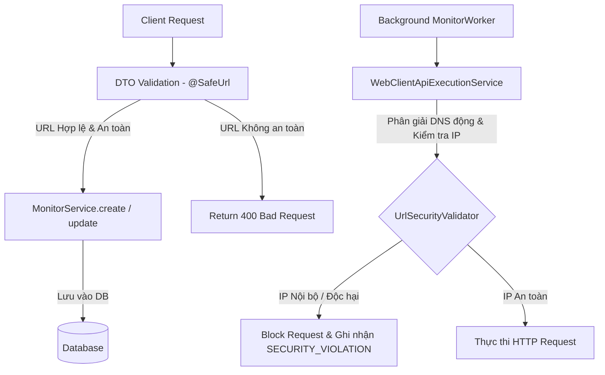

# Thiết Kế Đặc Tả Bảo Mật Ping Monitor Chống SSRF và URL Injection

## 1. Tổng Quan & Mục Tiêu

### Mục tiêu:
* **Ngăn chặn triệt để tấn công SSRF (Server-Side Request Forgery):** Không cho phép hacker cấu hình hoặc thực thi kiểm tra ping đến các địa chỉ IP nội bộ, localhost, loopback, link-local, multicast, hoặc cloud metadata (`169.254.169.254`).
* **Phòng chống tấn công DNS Rebinding:** Thực hiện phân giải DNS động ngay trước thời điểm thực thi gửi request (Execution Time) để chặn đứng các tên miền trỏ về IP nội bộ sau khi đăng ký thành công.
* **Ngăn chặn trèn mã độc (URL/CRLF/Parameter Injection):** Loại bỏ hoàn toàn các ký tự điều khiển lạ (nhất là CRLF `\r`, `\n`) trong URL, Custom Headers, và Query Parameters để bảo vệ hệ thống khỏi HTTP Response Splitting.
* **Đảm bảo Nguyên lý SOLID & Clean Architecture:** Tách biệt logic kiểm tra bảo mật ra thành một module dùng chung duy nhất, tích hợp mượt mà thông qua Spring Validation Annotation và Security Exception.

---

## 2. Kiến Trúc Giải Pháp

Giải pháp được phân chia theo cấu trúc nhiều lớp (Multi-layered Defense):

---

## 3. Chi Tiết Thiết Kế Các Thành Phần

### 3.1. Lớp Validator Trung Tâm: `UrlSecurityValidator.java`
* **Vị trí:** `com.example.demo.common.security.UrlSecurityValidator`
* **Nhiệm vụ:**
  * Parse URL chuỗi thành đối tượng `java.net.URI`.
  * Xác thực giao thức: Chỉ chấp nhận `http` và `https` (không phân biệt hoa thường).
  * Kiểm tra và loại bỏ các ký tự CRLF (`\r`, `\n`) trong URL.
  * Phân giải tên miền (DNS Resolution): Gọi `InetAddress.getAllByName(host)` để lấy toàn bộ danh sách IP.
  * Kiểm tra an toàn cho từng IP:
    * `address.isLoopbackAddress()` -> Chặn localhost (`127.0.0.0/8`, `::1`).
    * `address.isAnyLocalAddress()` -> Chặn wildcard (`0.0.0.0`, `::`).
    * `address.isLinkLocalAddress()` -> Chặn link-local (`169.254.0.0/16`, `fe80::/10`).
    * `address.isSiteLocalAddress()` -> Chặn mạng tư nhân (`10.0.0.0/8`, `172.16.0.0/12`, `192.168.0.0/16`).
    * `address.isMulticastAddress()` -> Chặn địa chỉ multicast.
    * Kiểm tra IP trùng khớp chính xác với địa chỉ cloud metadata AWS/GCP: `169.254.169.254`.

### 3.2. Ngoại Lệ Bảo Mật: `UrlSecurityValidationException.java`
* **Vị trí:** `com.example.demo.common.exceptions.UrlSecurityValidationException`
* **Nhiệm vụ:** Đưa ra thông báo chi tiết khi URL vi phạm chính sách bảo mật, tự động map với HttpStatus `400 BAD REQUEST` để phản hồi về Client một cách thân thiện.

### 3.3. Annotation Tùy Biến: `@SafeUrl` & `SafeUrlValidator`
* **Vị trí:**
  * Annotation: `com.example.demo.common.security.annotations.SafeUrl`
  * Thực thi: `com.example.demo.common.security.annotations.SafeUrlValidator`
* **Cách hoạt động:**
  * Tích hợp với `jakarta.validation` để validate các thuộc tính `url` trong DTOs khi Spring Controller nhận request.
  * Trích xuất thông tin lỗi chi tiết từ `UrlSecurityValidator` để gán vào `ConstraintValidatorContext` giúp hiển thị rõ nguyên nhân lỗi (VD: "URL trỏ tới dải mạng nội bộ không hợp lệ").

### 3.4. Cập Nhật DTOs: `CreateApiRequest` & `UpdateApiRequest`
* Thay đổi annotation `@URL` của Hibernate thành annotation `@SafeUrl` tùy biến.

### 3.5. Cập Nhật Tầng Thực Thi: `WebClientApiExecutionService.java`
* **Nhiệm vụ:**
  * Thực hiện gọi lại `UrlSecurityValidator.validateUrl(monitor.getUrl())` trước khi gọi `buildAndSendRequest`.
  * Nếu bắt được lỗi `UrlSecurityValidationException` (do DNS Rebinding chuyển sang IP nội bộ hoặc do URL độc hại), hệ thống sẽ:
    * Không gửi request đi.
    * Trả về kết quả `UptimeLogs` với `isUp = false`.
    * Đặt `errorType = "SECURITY_VIOLATION"`.
    * Đặt `errorMessage = "Chặn kết nối: Địa chỉ URL hoặc IP của mục tiêu không an sau (SSRF)"`.
    * Thiết lập `assertionStatus = "FAILED"` và `assertionMessage` tương ứng.

### 3.6. Cập Nhật Business Service: `MonitorService.java`
* **Nhiệm vụ:**
  * Kiểm tra sâu các tham số Headers và Query Parameters của cả `CreateApiRequest` và `UpdateApiRequest` để đảm bảo hoàn toàn sạch sẽ ký tự CRLF (`\r`, `\n`).
  * Ghi đè phương thức `update(UUID id, UpdateApiRequest requestDto)` để áp dụng cơ chế xác thực URL trước khi lưu chỉnh sửa vào cơ sở dữ liệu.

---

## 4. Kế Hoạch Kiểm Thử (Testing Strategy)

Chúng ta sẽ tạo các Unit Test để kiểm chứng toàn bộ giải pháp:
1. **Kiểm thử `UrlSecurityValidatorTest`:**
   * URL hợp lệ: `https://google.com`, `http://example.com`.
   * Chặn Localhost: `http://localhost`, `http://127.0.0.1`, `http://[::1]`.
   * Chặn Private IPs: `http://192.168.1.1`, `http://10.0.0.1`, `http://172.16.0.1`.
   * Chặn Metadata IP: `http://169.254.169.254/latest/meta-data`.
   * Chặn CRLF: `http://google.com\r\n/path`, `http://google.com%0d%0a/path`.
2. **Kiểm thử WebClient Integration:**
   * Giả lập ping một URL không an toàn và kiểm tra xem `WebClientApiExecutionService` có trả về log với `errorType = "SECURITY_VIOLATION"` và không thực sự tạo socket TCP kết nối hay không.
