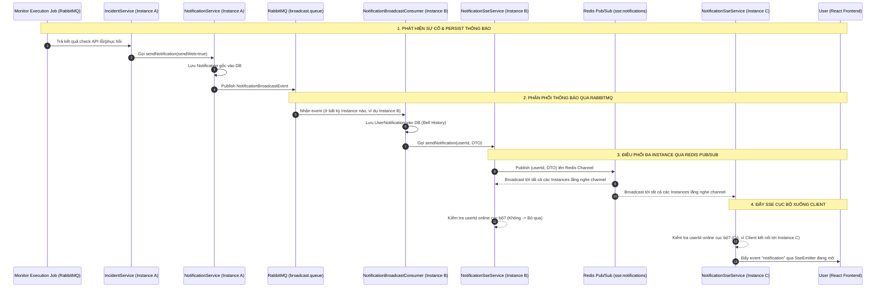

# Đặc tả thiết kế: Đẩy thông báo SSE trong môi trường Multi-Instance qua Redis Pub/Sub

> **Trạng thái:** Chờ phê duyệt từ User
> **Mục tiêu:** 
> 1. Lưu thông báo Down/Warning vào cơ sở dữ liệu để hiển thị trong lịch sử thông báo (bell notification).
> 2. Đẩy các cảnh báo này đến trình duyệt qua Server-Sent Events (SSE) theo thời gian thực.
> 3. Hỗ trợ chạy đa instance (Multi-instance / Horizontal Scaling) bằng cách điều phối thông báo qua Redis Pub/Sub.

---

## 🏛️ 1. Kiến trúc tổng thể & Luồng dữ liệu (Data Flow)

Khi tích hợp Redis Pub/Sub, luồng dữ liệu khi API gặp sự cố (Down/Warning) hoặc phục hồi (Up) sẽ chạy bất đồng bộ đa instance như sau:



---

## 💾 2. Thiết kế chi tiết & Thay đổi mã nguồn

### 2.1 Tích hợp thông báo tại `IncidentService.java`
Khi xảy ra sự cố cần thông báo (`notify == true`), ngoài việc gửi Email/Slack qua dispatcher, hệ thống sẽ gọi `NotificationService` để tạo thông báo hệ thống:

* **Dependency bổ sung:** Inject `UserRepository` và `NotificationService`.
* **Luồng xử lý:** Lấy email của User sở hữu Monitor trong transaction, sau đó gửi yêu cầu thông báo bất đồng bộ qua `afterCommit()` để đảm bảo tính nhất quán của dữ liệu.

```java
// Trong IncidentService.java
private final UserRepository userRepository;
private final NotificationService notificationService;

private void triggerWebNotification(Incident incident) {
    try {
        UUID userId = incident.getMonitor().getUserId();
        String userEmail = incident.getMonitor().getUser() != null 
                ? incident.getMonitor().getUser().getEmail() 
                : userRepository.findById(userId).map(User::getEmail).orElse(null);

        if (userEmail == null) {
            log.warn("[IncidentService] Không tìm thấy email của userId={} để gửi thông báo web", userId);
            return;
        }

        SendNotificationRequest request = new SendNotificationRequest();
        if (incident.getStatus() == IncidentStatus.RESOLVED) {
            request.setTitle("🟢 API đã phục hồi: " + incident.getMonitor().getName());
            request.setContent(String.format("API '%s' (%s) đã hoạt động bình thường trở lại. Status code: %d.",
                    incident.getMonitor().getName(),
                    incident.getMonitor().getUrl(),
                    incident.getLastStatusCode() != null ? incident.getLastStatusCode() : 200));
            request.setLevel(NotificationLevel.INFO);
        } else {
            String severitySymbol = incident.getSeverity() == IncidentSeverity.CRITICAL ? "🔴" : "⚠️";
            request.setTitle(String.format("%s Cảnh báo API: %s %s",
                    severitySymbol,
                    incident.getMonitor().getName(),
                    incident.getType()));
            request.setContent(String.format("Phát hiện lỗi tại API '%s' (%s). Trạng thái: %s. Nội dung: %s.",
                    incident.getMonitor().getName(),
                    incident.getMonitor().getUrl(),
                    incident.getSeverity(),
                    incident.getMessage()));
            request.setLevel(incident.getSeverity() == IncidentSeverity.CRITICAL 
                    ? NotificationLevel.SYSTEM 
                    : NotificationLevel.WARNING);
        }

        request.setTargetType(TargetType.SINGLE);
        request.setTargetValue(userEmail);
        request.setSendWeb(true);
        request.setSendEmail(false); // Email đã được EmailNotificationStrategy xử lý riêng

        notificationService.sendNotification(request);
        log.info("[IncidentService] Đã gửi sự kiện thông báo web sự cố cho userId={}", userId);
    } catch (Exception e) {
        log.error("[IncidentService] Lỗi gửi thông báo web cho incident {}: {}", incident.getId(), e.getMessage());
    }
}
```

* **Vị trí tích hợp:** Gọi `triggerWebNotification(saved)` (hoặc `triggerWebNotification(i)` đối với resolution) ngay cạnh các vị trí gọi `notificationDispatcher.dispatch(...)`.

---

### 2.2 Cấu hình Redis Pub/Sub
Chúng ta sử dụng Redis để phát tán sự kiện SSE ra toàn bộ các instance.

#### A. DTO payload trung gian (`SseNotificationPayload.java`)
```java
package com.example.demo.modules.notification.dto;

import lombok.AllArgsConstructor;
import lombok.Data;
import lombok.NoArgsConstructor;
import java.io.Serializable;
import java.util.UUID;

@Data
@NoArgsConstructor
@AllArgsConstructor
public class SseNotificationPayload implements Serializable {
    private UUID userId;
    private UserNotificationResponse notification;
}
```

#### B. Cấu hình Redis Pub/Sub Listener (`RedisPubSubConfig.java`)
Đăng ký nhận tin từ channel `sse:notifications` trên mọi instance:

```java
package com.example.demo.common.config;

import com.example.demo.modules.notification.services.RedisNotificationSubscriber;
import org.springframework.context.annotation.Bean;
import org.springframework.context.annotation.Configuration;
import org.springframework.data.redis.connection.RedisConnectionFactory;
import org.springframework.data.redis.listener.ChannelTopic;
import org.springframework.data.redis.listener.RedisMessageListenerContainer;
import org.springframework.data.redis.listener.adapter.MessageListenerAdapter;

@Configuration
public class RedisPubSubConfig {

    public static final String SSE_CHANNEL = "sse:notifications";

    @Bean
    public RedisMessageListenerContainer redisMessageListenerContainer(
            RedisConnectionFactory connectionFactory,
            MessageListenerAdapter listenerAdapter) {
        RedisMessageListenerContainer container = new RedisMessageListenerContainer();
        container.setConnectionFactory(connectionFactory);
        container.addMessageListener(listenerAdapter, new ChannelTopic(SSE_CHANNEL));
        return container;
    }

    @Bean
    public MessageListenerAdapter listenerAdapter(RedisNotificationSubscriber subscriber) {
        return new MessageListenerAdapter(subscriber, "onMessage");
    }
}
```

#### C. Lớp đăng ký nhận tin từ Redis (`RedisNotificationSubscriber.java`)
Nhận JSON từ Redis channel, giải mã và thực hiện đẩy SSE cục bộ.

```java
package com.example.demo.modules.notification.services;

import com.example.demo.modules.notification.dto.SseNotificationPayload;
import com.fasterxml.jackson.databind.ObjectMapper;
import lombok.RequiredArgsConstructor;
import lombok.extern.slf4j.Slf4j;
import org.springframework.data.redis.connection.Message;
import org.springframework.data.redis.connection.MessageListener;
import org.springframework.stereotype.Component;

@Component
@RequiredArgsConstructor
@Slf4j
public class RedisNotificationSubscriber implements MessageListener {

    private final ObjectMapper objectMapper;
    private final NotificationSseService notificationSseService;

    @Override
    public void onMessage(Message message, byte[] pattern) {
        try {
            SseNotificationPayload payload = objectMapper.readValue(message.getBody(), SseNotificationPayload.class);
            log.info("[RedisPubSub] Nhận thông điệp SSE cho userId={}", payload.getUserId());
            notificationSseService.sendNotificationLocal(payload.getUserId(), payload.getNotification());
        } catch (Exception e) {
            log.error("[RedisPubSub] Lỗi phân giải tin nhắn Redis Pub/Sub: {}", e.getMessage());
        }
    }
}
```

---

### 2.3 Phân tách xử lý tại `NotificationSseService`
Chúng ta bổ sung phương thức đẩy tin cục bộ trên kết nối vật lý của instance hiện tại, tách biệt với phương thức phát tán qua Redis.

#### A. Cập nhật Interface `NotificationSseService.java`
```java
// Bổ sung method
void sendNotificationLocal(UUID userId, UserNotificationResponse notification);
```

#### B. Cập nhật `NotificationSseServiceImpl.java`
* Thay đổi `sendNotification` thành hành động phát tin lên Redis channel.
* Triển khai `sendNotificationLocal` để kiểm tra map kết nối vật lý cục bộ và đẩy tin qua socket.

```java
// Bổ sung inject
private final RedisTemplate<String, Object> redisTemplate;

@Override
public void sendNotification(UUID userId, UserNotificationResponse notification) {
    log.info("[SSE] Publishing notification to Redis channel for userId={}", userId);
    SseNotificationPayload payload = new SseNotificationPayload(userId, notification);
    redisTemplate.convertAndSend(RedisPubSubConfig.SSE_CHANNEL, payload);
}

@Override
public void sendNotificationLocal(UUID userId, UserNotificationResponse notification) {
    SseEmitter emitter = emitters.get(userId);
    if (emitter != null) {
        try {
            emitter.send(SseEmitter.event()
                    .name("notification")
                    .data(notification));
            log.info("[SSE] [Local] Đã đẩy thông báo tới userId={}", userId);
        } catch (IOException e) {
            log.warn("[SSE] [Local] Lỗi khi đẩy tin tới userId={}, tự động đóng kết nối: {}", userId, e.getMessage());
            emitters.remove(userId);
            emitter.completeWithError(e);
        }
    } else {
        log.debug("[SSE] [Local] Người dùng userId={} đang offline trên instance này", userId);
    }
}
```

---

## 🧪 3. Kế hoạch kiểm thử & Xác minh (Verification Plan)

1. **Unit Test cho `IncidentService`**:
   * Xác minh khi có sự cố, `IncidentService` gọi `NotificationService.sendNotification` với tham số cấu hình chính xác (sendWeb=true, sendEmail=false, level tương ứng).
2. **Unit Test cho `NotificationSseServiceImpl`**:
   * Xác minh khi gọi `sendNotification`, nó thực hiện gọi `redisTemplate.convertAndSend` với payload chính xác mà không đẩy trực tiếp qua emitter.
   * Xác minh khi gọi `sendNotificationLocal`, nó đẩy dữ liệu thành công qua `SseEmitter` nếu user online cục bộ.
3. **Integration Test / Kiểm thử tích hợp đa instance**:
   * Giả lập 2 instance cùng kết nối tới một Redis Server cục bộ.
   * Client kết nối SSE tới Instance A.
   * Gửi sự kiện thông báo thông qua API của Instance B.
   * Xác minh Client kết nối ở Instance A nhận được thông báo thời gian thực thành công.
