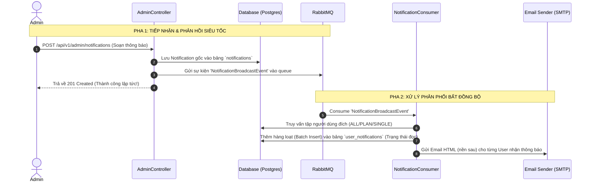

# Đặc tả thiết kế Backend: Hệ thống thông báo sử dụng hàng đợi RabbitMQ (Spring Boot)

> **Trạng thái:** Chờ phê duyệt từ User (Đã cập nhật tích hợp RabbitMQ)
> **Mục tiêu:** Thiết kế hệ thống API, Cơ sở dữ liệu và Luồng xử lý phân phối thông báo diện rộng thông qua hàng đợi RabbitMQ giúp tối ưu hóa hiệu năng tối đa cho hệ thống.

---

## 🏛️ 1. Cấu trúc thư mục Module `notification` mới
Chúng ta sẽ tổ chức code theo cấu trúc Clean Architecture chuẩn của dự án:
```text
com/example/demo/modules/notification/
├── config/
│   └── NotificationMQConfig.java            # Cấu hình hàng đợi RabbitMQ (Queues)
├── controllers/
│   ├── AdminNotificationController.java     # API dành cho quản trị viên (gửi, xem lịch sử)
│   └── UserNotificationController.java      # API dành cho người dùng (lấy danh sách, đọc)
├── dto/
│   ├── SendNotificationRequest.java         # DTO nhận yêu cầu gửi thông báo từ Admin
│   ├── NotificationResponse.java            # DTO trả về chi tiết thông báo
│   ├── UserNotificationResponse.java        # DTO trả về danh sách thông báo kèm trạng thái đọc của User
│   └── NotificationBroadcastEvent.java      # Event DTO (Java Record) gửi vào RabbitMQ
├── entities/
│   ├── Notification.java                    # Bảng thông tin gốc của thông báo đã gửi
│   └── UserNotification.java                # Bảng theo dõi trạng thái đọc của từng User
├── enums/
│   ├── TargetType.java                      # Enum đối tượng nhận: ALL, PLAN, SINGLE
│   └── NotificationLevel.java               # Enum mức độ thông báo: INFO, WARNING, SYSTEM
├── repositories/
│   ├── NotificationRepository.java          # JPA Repository cho Notification
│   └── UserNotificationRepository.java      # JPA Repository cho UserNotification
└── services/
    ├── NotificationService.java             # Interface định nghĩa nghiệp vụ chính
    ├── NotificationServiceImpl.java         # Triển khai gửi tin nhắn vào RabbitMQ
    └── NotificationBroadcastConsumer.java   # Consumer của RabbitMQ xử lý tạo trạng thái đọc & gửi Email
```

---

## ⚙️ 2. Luồng xử lý phân phối thông báo qua RabbitMQ

Bằng việc tích hợp RabbitMQ, tiến trình gửi thông báo được phân tách làm 2 pha hoàn toàn độc lập:



---

## 🗄️ 3. Thiết kế Cơ sở dữ liệu (Database Design)

### Bảng 1: `notifications` (Thông tin gốc thông báo Admin đã phát)
```sql
CREATE TABLE notifications (
    id UUID PRIMARY KEY,
    title VARCHAR(255) NOT NULL,
    content TEXT NOT NULL,
    target_type VARCHAR(20) NOT NULL, -- ALL, PLAN, SINGLE
    target_value VARCHAR(255),        -- Email người nhận hoặc Tên gói cước (FREE/PRO/ENTERPRISE)
    level VARCHAR(20) NOT NULL,       -- INFO, WARNING, SYSTEM
    send_web BOOLEAN DEFAULT TRUE NOT NULL,
    send_email BOOLEAN DEFAULT TRUE NOT NULL,
    created_at TIMESTAMP DEFAULT CURRENT_TIMESTAMP NOT NULL
);
```

### Bảng 2: `user_notifications` (Trạng thái đọc của từng người dùng)
```sql
CREATE TABLE user_notifications (
    id UUID PRIMARY KEY,
    user_id UUID NOT NULL,            -- Khóa ngoại liên kết tới bảng users
    notification_id UUID NOT NULL,    -- Khóa ngoại liên kết tới bảng notifications
    is_read BOOLEAN DEFAULT FALSE NOT NULL,
    read_at TIMESTAMP,
    CONSTRAINT fk_user FOREIGN KEY (user_id) REFERENCES users(id) ON DELETE CASCADE,
    CONSTRAINT fk_notification FOREIGN KEY (notification_id) REFERENCES notifications(id) ON DELETE CASCADE
);
CREATE INDEX idx_user_read ON user_notifications(user_id, is_read);
```

---

## ✉️ 4. Chi tiết cấu hình & Event DTO của RabbitMQ

### 4.1 Cấu hình hàng đợi (`NotificationMQConfig.java`)
```java
@Configuration
public class NotificationMQConfig {
    public static final String BROADCAST_QUEUE = "notification.broadcast.queue";

    @Bean
    public Queue notificationBroadcastQueue() {
        return new Queue(BROADCAST_QUEUE, true); // durable = true
    }
}
```

### 4.2 Sự kiện gửi thông báo (`NotificationBroadcastEvent.java`)
```java
public record NotificationBroadcastEvent(
    UUID notificationId,
    String title,
    String content,
    String targetType,
    String targetValue,
    String level,
    boolean sendWeb,
    boolean sendEmail
) {}
```

---

## 🔌 5. Các REST API Endpoints chi tiết

### 5.1 Endpoints dành cho quản trị viên (Admin Panel)
* **Gửi thông báo mới**: `POST /api/v1/admin/notifications`
* **Lấy lịch sử thông báo đã gửi**: `GET /api/v1/admin/notifications`

### 5.2 Endpoints dành cho người dùng cá nhân (User Dashboard)
* **Lấy danh sách thông báo của User**: `GET /api/v1/notifications` (Hỗ trợ `?unreadOnly=true`)
* **Đánh dấu thông báo đã đọc**: `PUT /api/v1/notifications/{id}/read`
* **Đánh dấu tất cả thông báo đã đọc**: `PUT /api/v1/notifications/read-all`

---

## 🧪 6. Kế hoạch kiểm thử & Xác minh (Verification Plan)
1. **Kiểm tra đẩy hàng đợi (Publishing Check)**: Gửi thông báo qua API Admin và xác minh tin nhắn được đẩy vào hàng đợi `notification.broadcast.queue` trên trang quản trị RabbitMQ.
2. **Kiểm tra tiêu thụ hàng đợi (Consumer Check)**: Bật Worker và kiểm định xem các bản ghi `user_notifications` của tập người nhận có tự động sinh ra và email được gửi đi chính xác hay không.
3. **Kiểm thử khả năng chịu lỗi (Error Handling)**: Mô phỏng dịch vụ email SMTP bị lỗi tạm thời, xác minh tin nhắn được giữ lại trong queue và tự động thử lại thành công sau khi SMTP hoạt động bình thường.


# Kế hoạch thực thi: Phát triển Backend API tích hợp RabbitMQ và Đa kênh (SSE & Email)

> **Dành cho Agent:** Sử dụng `superpowers:subagent-driven-development` hoặc `superpowers:executing-plans` để thực thi kế hoạch này theo từng bước. 

**Mục tiêu:** Xây dựng hoàn chỉnh Module `notification` tích hợp hàng đợi RabbitMQ, hỗ trợ lựa chọn phân phối đa kênh (Web SSE và Email) độc lập hoặc song song.

---

### Danh sách các nhiệm vụ (Tasks List):

- [ ] **Nhiệm vụ 1: Định nghĩa cơ sở dữ liệu & JPA Entities**
  * **Tệp tin:**
    * Tạo `enums/TargetType.java` (`ALL`, `PLAN`, `SINGLE`)
    * Tạo `enums/NotificationLevel.java` (`INFO`, `WARNING`, `SYSTEM`)
    * Tạo `entities/Notification.java` (Thêm các trường `sendWeb` và `sendEmail` kiểu boolean)
    * Tạo `entities/UserNotification.java` (Trạng thái đọc tin trên Web của từng User)
  * **Mô tả:** Ánh xạ JPA Entity chuẩn với DB. Cột `send_web` và `send_email` sẽ được ánh xạ trong bảng `notifications`.

- [ ] **Nhiệm vụ 2: Đăng ký hàng đợi RabbitMQ & định nghĩa Event DTO**
  * **Tệp tin:**
    * Tạo `config/NotificationMQConfig.java` (Đăng ký queue `notification.broadcast.queue`)
    * Tạo `dto/NotificationBroadcastEvent.java` (Java Record chứa thêm `sendWeb` và `sendEmail`)
  * **Mô tả:** Thiết lập cấu trúc truyền tải sự kiện thông qua Message Queue.

- [ ] **Nhiệm vụ 3: Tạo Repositories và logic Producer đẩy tin vào Hàng đợi**
  * **Tệp tin:**
    * Tạo `repositories/NotificationRepository.java`
    * Tạo `repositories/UserNotificationRepository.java`
    * Tạo `services/NotificationService.java`
    * Tạo `services/NotificationServiceImpl.java` (Lưu bản ghi gốc và đẩy Event DTO sang RabbitMQ)
  * **Mô tả:** Nhận request gửi từ Admin, lưu vào DB, ánh xạ các trường kênh gửi sang Event và đẩy nhanh vào RabbitMQ.

- [ ] **Nhiệm vụ 4: Xây dựng Worker Consumer xử lý đa kênh bất đồng bộ**
  * **Tệp tin:**
    * Tạo `services/NotificationBroadcastConsumer.java` (`@RabbitListener`)
  * **Mô tả:** 
    * Lắng nghe queue `notification.broadcast.queue`.
    * **Xử lý kênh Web SSE:** Nếu `event.sendWeb()` là true, tiến hành truy vấn nhóm người nhận đích và tạo hàng loạt bản ghi chưa đọc vào bảng `user_notifications` (để Web Client kéo hoặc nhận thời gian thực).
    * **Xử lý kênh Email:** Nếu `event.sendEmail()` là true, duyệt qua danh sách email người nhận đích và gọi `EmailSenderService` để gửi thư điện tử.

- [ ] **Nhiệm vụ 5: Phát triển các REST APIs điều phối**
  * **Tệp tin:**
    * Tạo `controllers/AdminNotificationController.java` (API gửi và lấy lịch sử Admin)
    * Tạo `controllers/UserNotificationController.java` (API lấy tin và cập nhật trạng thái đọc của User)
  * **Mô tả:** Hoàn thiện các REST API kết nối Front-to-Back.
